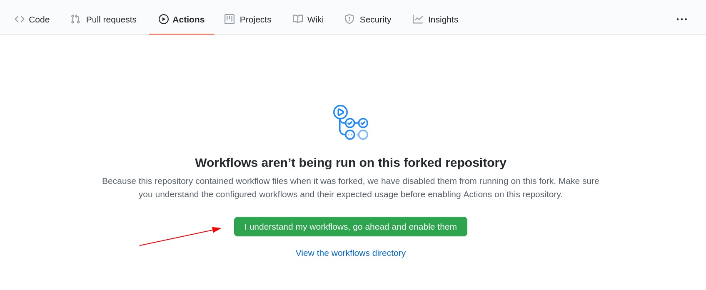
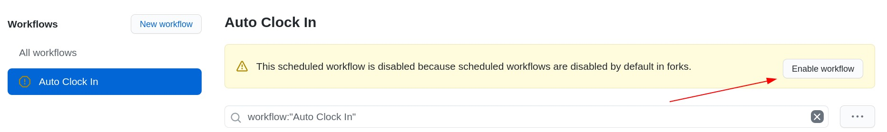
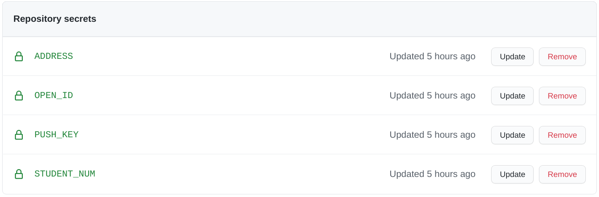
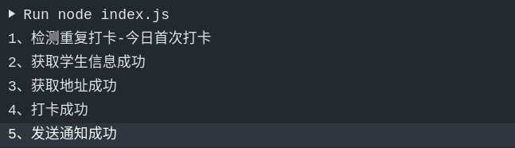

# 重庆邮电大学定时健康打卡脚本


### 事先声明

1. 本脚本仅供学习交流使用，请勿过分依赖。时刻注意每天是否打卡成功，如若失败，请手动打卡。
2. 本脚本仅限低风险地区学生使用，并且不要前往中高风险地区。如果身体出现新冠肺炎相关症状，请立即报告辅导员。
3. 本脚本需要自行抓包才能正常使用，为了避免脚本被滥用，在此我不会提供抓包相关教程。抓包工具 iOS 推荐 Stream，Android 推荐 HttpCanary。
4. 开发者对使用或不使用本脚本造成的问题不负任何责任，不对脚本执行效果做出任何担保，原则上不提供任何形式的技术支持。


### 功能介绍

利用 Github Aciton 实现每天定时自动打卡，并将打卡信息推送到微信，所有私密信息均存放在 Github Secrets，不会公开。
工作原理就是发送一个 POST 请求到 WE 重邮的服务器，这个 POST 请求的上传的信息包括
| 键名                        | 备注                                        | 默认值           |
| :-------------------------: | :--------------------------------------:    | :----------:     |
| openid                      | 个人唯一的身份标示，与微信绑定                          | **自行抓包获得** |
| timestamp                   | 当前时间戳                                  | 自动获取         |
| mrdkkey                     | 通过日期 + 时间生成的字符串                    | 自动获取 |
| xh                          | 学号                                        | **手动输入**     |
| name                        | 姓名                                        | 自动获取         |
| xb                          | 性别                                        | 自动获取         |
| szdq                        | 填写的地址                                  | 自动获取         |
| xxdz                        | 填写的详细地址                              | **手动输入**     |
| localtionBig                | GPS 定位生成的位置信息                      | 自动获取         |
| localtionSmall              | GPS 定位生成的位置信息                      | 自动获取         |
| latitude                    | GPS 定位生成的纬度                          | 自动获取         |
| longitude                   | GPS 定位生成的经度                          | 自动获取         |
| ywjcqzbl                    | 新冠肺炎风险等级，非低风险地区请勿使用      | 低风险           |
| ywjchblj                    | 14 天内是否有中高风险地区旅居史             | 无               |
| xjzdywqzbl                  | 14 天内是否接触过有中高风险地区旅居史的人员 | 无               |
| twsfzc                      | 今日体温是否正常                            | 是               |
| ywytdzz                     | 今日是否有与新冠病毒感染有关的症状          | 无               |
| beizhu                      | 备注                                        | 无               |


### （改）-新接口


模拟打卡请求的新字段：

```
{"xxdz":"崇文路2号重庆邮电大学","szdq":"重庆市,重庆市,南岸区",
"name":"你的名字","xh":"学号","xb":"男",
"openid":"oIaII0TZQgzGo52qlqJ6Tsye9ahk",
"locationBig":"中国,重庆市,重庆市,渝北区",
"locationSmall":"重庆市渝北区龙湖东路",
"latitude":29.60396,"longitude":106.515602,
"ywjcqzbl":"低风险","ywjchblj":"无","xjzdywqzbl":"无","twsfzc":"是",
"ywytdzz":"无","beizhu":"无",
"mrdkkey":"可以不需要该字段","timestamp":1626312142}


唯一验证的就是timestamp，需要用程序生成时间戳，其他字段可以按需固定修改。
```


打卡接口：

```
模拟打卡接口
https://we.cqupt.edu.cn/api/mrdk/post_mrdk_info.php


检测重复打卡接口
https://we.cqupt.edu.cn/api/mrdk/get_mrdk_flag.php


```


检测重复打卡返回数据（成功打卡时，count表示打卡的次数，status表示打卡成功）：

```
{
  "status": 200,
  "message": "ok",
  "data": {
    "count": "0"
  }
}
```


### （新）使用方法

1. Star 并 Fork 本仓库，进入 Actions 界面，允许 workflow 运行，注意需要下方两个地方都需要允许。  


2. 在 Settings->Secrets 中添加以下几个值，这些数据不会公开，填写时请注意不要有换行
  - OPEN_ID：自行抓包获得。提示一下，进入资讯页面就可以获得 openid。
  - STUDENT_NUM：学号。
  - ADDRESS：详细住址，一般区县+小区/街道就可以了，比如南岸区重庆邮电大学。
  - PUSH_KEY：本脚本通过**新版本的** [Sever 酱](https://sct.ftqq.com/forward) 来实现推送打卡信息到微信，如果你需要开启这个服务，就按照网站首页提示即可，你会获得一个 SCKEY，你需要填入 PUSH_KEY 中。如果你不需要推送，则可以不填。 

3. 修改脚本执行时间，修改 `CQUPT_Health_ClockIn/.github/workflows/work.yaml`，可以将仓库 Clone 到本地，也可以在线修改。Github 定时执行会有延迟，大概是 10 到 20 分钟。每次 Push 也会触发打卡，脚本会检测重复打卡。

4. 运行结果  

5. 

6. 我这里使用的是server酱 IOS端消息通道 Bark软件接收的信息（由于我打卡过了 显示打卡失败）

  

### 
